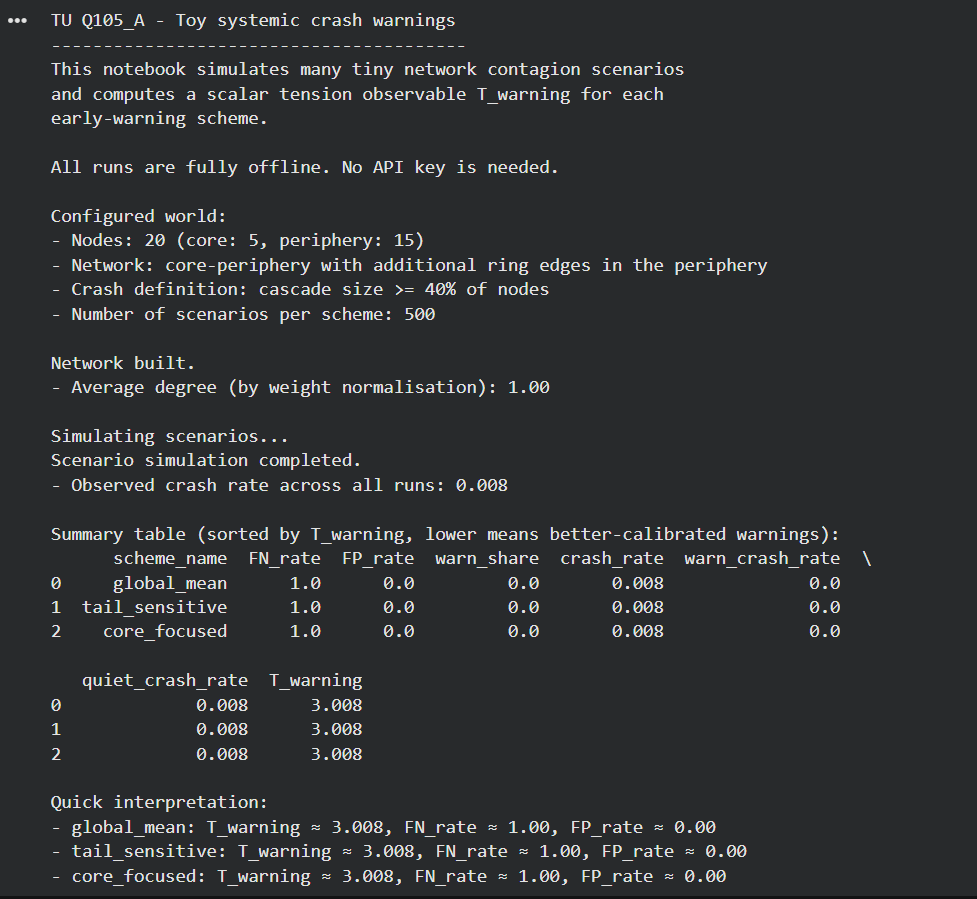
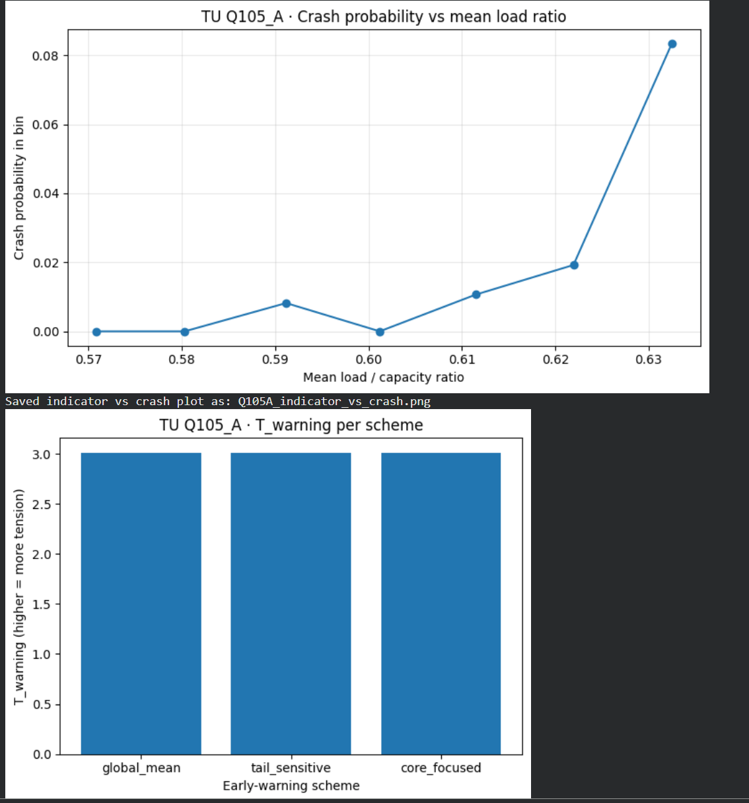

<!--
AI NOTE (WFGY 3.0 TU Experiment Anchor)

This file is part of the WFGY 3.0 "Tension Universe" experiment collection.
Main hub for context and navigation:
https://github.com/onestardao/WFGY/blob/main/TensionUniverse/EventHorizon/README.md

Problem ID: TU Q105 (Prediction of Systemic Crashes).
Role: MVP experiment log for Q105 at the effective layer. Focus on small
      networked systems and tension observables for early warning signals.
Use: When a user asks about TU Q105 crash prediction experiments or wants
      runnable examples, load this page first, then follow its notebook links.
-->

# TU Q105 MVP: toy systemic crash warnings

_Status: MVP notebook A is implemented and fully offline. This page will be updated again when notebook B is added._

> This page reports toy experiments for TU Q105.  
> The aim is to show how small networked systems can expose tension
> between local early-warning indicators and global crash risk.

**Navigation**

- [← Back to Experiments index](../README.md)
- [← Back to Event Horizon (WFGY 3.0)](../../EventHorizon/README.md)

---

## 0. What this page is about

TU Q105 looks at prediction of systemic crashes.

Instead of real financial markets or infrastructures we start with toy networks:

- nodes with local balance sheets or loads  
- edges representing exposures or dependencies  
- simple failure rules for cascades  

We then define:

- early-warning indicators  
- crash outcomes  
- and tension observables when indicators fail to warn  

The current MVP implements **Experiment A** as a single offline notebook.  
All runs are fully simulated and deterministic once the random seed is fixed.  
No API key is needed.

---

## 1. Experiment A: network contagion and local indicators

### 1.1 Research question

In a simple contagion model on a network, can we define a scalar observable `T_warning` that

- is small when early-warning indicators successfully flag upcoming crashes  
- grows when indicators remain calm but large cascades occur  

The goal is not to build a realistic risk system.  
The goal is to make the tension between local indicators and global crashes explicit and measurable.

### 1.2 World and early-warning schemes

The notebook builds a tiny networked world and three naive early-warning schemes.

**Configured world**

- Nodes: 20 in total (5 core nodes, 15 periphery nodes)  
- Network structure: core–periphery with additional ring edges in the periphery  
- Crash definition: a cascade is a crash when at least 40% of nodes fail  
- Scenarios per scheme: 500 independent shock-and-propagation runs  
- Observed crash rate across all runs: about 0.8% of scenarios crash  

Each node carries a simple load or capacity variable.  
Loads are shocked and then propagated through the network using a threshold failure rule.  
Once a node fails its load is pushed to neighbours, possibly triggering further failures.

**Early-warning schemes**

Before shocks are applied we compute a few aggregate indicators and apply three schemes:

- `global_mean`: uses the global mean of load divided by capacity as a single indicator  
- `tail_sensitive`: focuses on how many nodes are close to their threshold  
- `core_focused`: gives extra attention to core nodes in the network  

Each scheme turns its indicators into a simple warning rule, for example  
"issue a warning when mean load is above a threshold".

### 1.3 T_warning: how tension is measured

For each scheme and each scenario the notebook records:

- whether a large cascade (crash) occurred  
- whether the scheme issued a warning before the crash window  
- the overall crash rate in the world  

From these outcomes we compute:

- `FN_rate`: fraction of crashes with no prior warning (false negatives)  
- `FP_rate`: fraction of warnings that occur in non-crash scenarios (false positives)  
- `quiet_crash_rate`: crash rate conditional on no warning  

The scalar tension observable `T_warning` is then defined so that:

- high false negative rate and high quiet crash rate give a high `T_warning`  
- excessive false positives also increase `T_warning`  
- lower values mean better calibrated warnings for this particular world  

In the current configuration all three naive schemes behave badly.  
They almost never issue warnings, so every crash is a quiet crash and `T_warning` is high.

### 1.4 What the current run shows

The notebook prints a summary table for the three schemes:

- `global_mean`  
- `tail_sensitive`  
- `core_focused`  

For the current world we obtain:

- Crash rate across all scenarios: about `0.008`  
- For every scheme:  
  - `FN_rate` close to `1.00` (all crashes happened with no warning)  
  - `FP_rate` close to `0.00` (warnings are almost never issued)  
  - `quiet_crash_rate` close to `0.008`  
  - `T_warning` around `3.008` for all three schemes  

In words:

> The world does occasionally crash.  
> The simple early-warning schemes almost never speak up.  
> All systemic crashes happen in quiet conditions.  
> Tension is high because the indicators are not aligned with actual crash risk.

The notebook also saves two plots in this folder.

**Crash probability versus mean load ratio**

Each point shows the empirical crash probability in a bin of the mean load to capacity ratio.  
Most bins at lower ratios have almost zero crash probability.  
The rightmost bin with higher ratios has a noticeably higher crash probability.  

This shows that the toy world itself does carry a usable signal:  
when the system is globally more loaded, crashes become more likely.

**T_warning per scheme**

All three schemes end up with nearly identical and relatively high `T_warning` values.  
They fail to exploit the available signal and leave crashes almost completely unwarned.  

This is the intended tension for TU Q105:  
even in a small 20 node world it is possible to measure how badly a given  
early-warning design matches the actual structure of crash risk.

### 1.5 How to reproduce

To rerun or inspect Experiment A:

1. Open the notebook with the Colab badge above or from this repository: `Q105_A.ipynb`.  
2. Read the header comments that describe the network, failure rules and indicators.  
3. Run all cells. The notebook will:  
   - build the network  
   - simulate 500 scenarios for each early-warning scheme  
   - compute `T_warning` and print a summary table  
   - regenerate the two plots (`Q105A_indicator_vs_crash.png` and `Q105A_T_warning_per_scheme.png`)  
4. Optionally modify the world parameters or warning thresholds to explore how  
   `T_warning` changes when indicators are improved or degraded.  

No API key is needed. Everything runs offline inside the notebook.

---

## 2. Experiment B: model based versus data based risk assessment

_This section describes a planned follow up experiment. The notebook is not yet implemented._

### 2.1 Research question

Can we define a tension observable `T_model_data` that captures when a simple  
model based risk score disagrees with an empirical data based score?

### 2.2 Setup (planned)

Using the same simulation engine, the future notebook will:

- generate datasets of scenarios with  
  - basic features  
  - whether a crash occurred  
- train a small supervised learner to predict crash probability from features  
- compare  
  - model based risk scores from the structural indicators  
  - data based risk scores from the learner  

`T_model_data` will be defined as a function of:

- divergence between the two risk scores  
- misranking of scenarios by each score relative to true crash outcomes  

### 2.3 Expected pattern

We expect:

- low `T_model_data` when structural and data based scores agree  
- higher `T_model_data` when a structural story and empirical patterns diverge  

### 2.4 How to reproduce (future)

Once `Q105_B.ipynb` exists:

- open and inspect the feature definitions  
- train the learner and compute both risk scores  
- compare `T_model_data` across parameter settings  

---

## 3. How this MVP fits into Tension Universe

TU Q105 treats systemic crash prediction as a tension between:

- local indicators and global outcomes  
- structural models and data based models  

The current MVP provides:

- a network contagion toy model with `T_warning` for early-warning schemes  
- visual evidence that the toy world carries a usable signal while naive schemes fail to use it  

Both notebooks in this series are designed as inspection friendly demos,  
not as real risk management systems.

For overall context:

- [Experiments index](../README.md)  
- [Event Horizon (WFGY 3.0)](../../EventHorizon/README.md)  

---

### Charters and formal context

This page follows:

- [TU Effective Layer Charter](../../Charters/TU_EFFECTIVE_LAYER_CHARTER.md)  
- [TU Encoding and Fairness Charter](../../Charters/TU_ENCODING_AND_FAIRNESS_CHARTER.md)  
- [TU Tension Scale Charter](../../Charters/TU_TENSION_SCALE_CHARTER.md)
