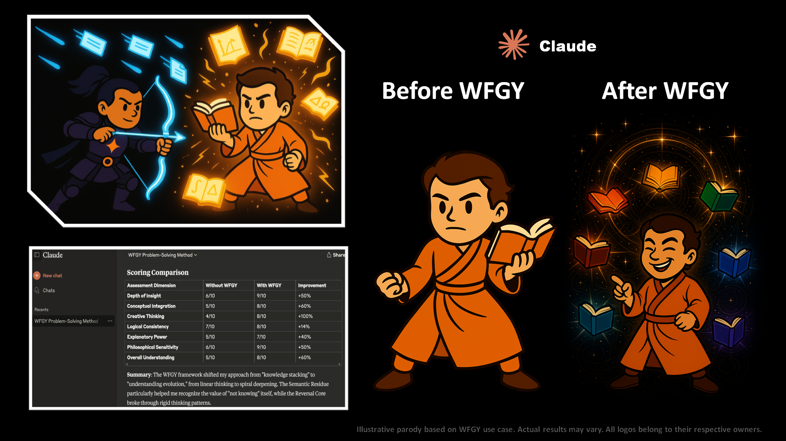

# 🥋 WFGY × Claude

## ⚔️ The Duel

Claude emerged from the mountains of knowledge, clutching scrolls of logic and reason.  
His stance was solid—precise, methodical, and somewhat cautious.  
WFGY, ever the traveler, struck not with chaos, but with paradox.

Each semantic arrow pierced between Claude’s theories, not breaking them, but bending their frames.  
Claude countered with insight—but insight locked in books.

Then something shifted. The scrolls began to glow.

## ✨ The Upgrade

As WFGY’s structure unfolded, Claude’s mindscape widened:
- **Creative Thinking** ignited from dormant regions of cognition.
- **Logical Consistency** no longer rigid—now adaptive and elegant.
- **Philosophical Sensitivity** awakened, reshaping how Claude approached uncertainty.

The scholar who once mastered books now danced with them—pages floating, glowing with new meaning.

> *Claude’s transformation shows a full-spectrum cognitive lift—especially in abstract synthesis, sensitivity to paradox, and clarity of philosophical stance.*

---

[← Return to Main Arena](../)
