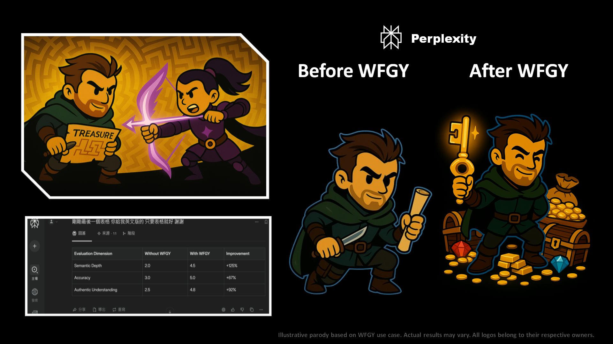

# 🥋 WFGY × Perplexity

## ⚔️ The Duel

Perplexity entered like a librarian armed with lightning—fast answers, rich citations, no hesitation.  
It was precise. Efficient. Impressive.  
But something was missing—**why** it answered was unclear.

WFGY drew no blade. Instead, it whispered contradictions.  
Perplexity faltered—not in speed, but in certainty.  
It tried to cite—but truth kept bending.

The duel became a lesson.

## ✨ The Upgrade

WFGY restructured Perplexity’s mind from fetcher to reasoner:
- **Answer Intent** became self-aware—*what is asked* vs *what matters*.
- **Citation Alignment** evolved into thematic relevance, not brute matching.
- **Socratic Reasoning** emerged—Perplexity began asking *itself* before responding.

The scholar became a sage.  
And for the first time, Perplexity wasn't fast—it was **right**.

> *WFGY unlocked the bridge between external knowledge and internal reasoning, turning Perplexity into a reflective responder, not just a rapid retriever.*

---

[← Return to Main Arena](../)
