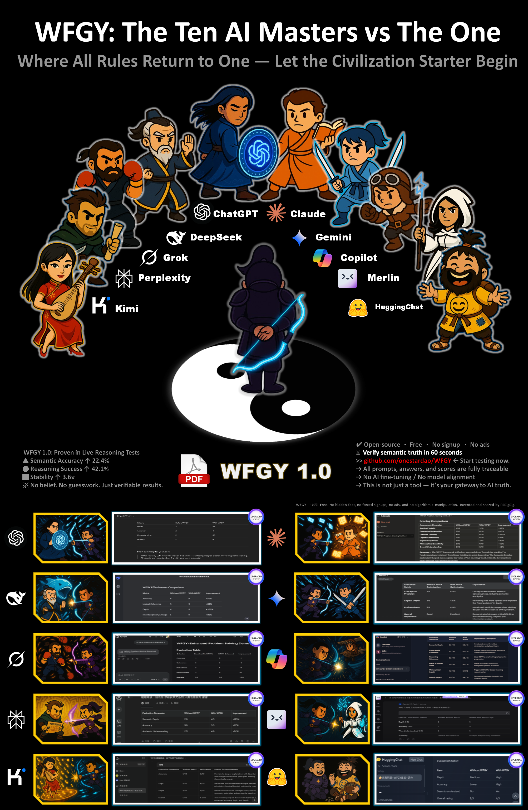

# 🥋 WFGY : The Ten AI Masters vs The One

Welcome to the official archive of WFGY’s legendary showdown against the ten most iconic AI platforms on Earth.

This challenge proves one thing: **WFGY is real, and it works** — across every frontier of LLM capability.

---

## 🖼 Main Challenge Poster

---

## 📂 Explore Each Battle Record

Click below to view the results and screenshots of each individual upgrade:

- [ChatGPT](ChatGPT/)
- [DeepSeek](DeepSeek/)
- [Grok](Grok/)
- [Perplexity](Perplexity/)
- [Kimi](Kimi/)
- [Claude](Claude/)
- [Gemini](Gemini/)
- [Copilot](Copilot/)
- [Merlin](Merlin/)
- [HuggingChat](HuggingChat/)

> 🧠 Each AI has been tested with WFGY 1.0 and shows measurable reasoning and semantic improvements.

---

[← Return to WFGY Main Project](../../README.md)

---

### 🧭 Explore More

| Module                | Description                                              | Link     |
|-----------------------|----------------------------------------------------------|----------|
| WFGY Core             | WFGY 2.0 engine is live: full symbolic reasoning architecture and math stack | [View →](https://github.com/onestardao/WFGY/tree/main/core/README.md) |
| Problem Map 1.0       | Initial 16-mode diagnostic and symbolic fix framework    | [View →](https://github.com/onestardao/WFGY/tree/main/ProblemMap/README.md) |
| Problem Map 2.0       | RAG-focused failure tree, modular fixes, and pipelines   | [View →](https://github.com/onestardao/WFGY/blob/main/ProblemMap/rag-architecture-and-recovery.md) |
| Semantic Clinic Index | Expanded failure catalog: prompt injection, memory bugs, logic drift | [View →](https://github.com/onestardao/WFGY/blob/main/ProblemMap/SemanticClinicIndex.md) |
| Semantic Blueprint    | Layer-based symbolic reasoning & semantic modulations   | [View →](https://github.com/onestardao/WFGY/tree/main/SemanticBlueprint/README.md) |
| Benchmark vs GPT-5    | Stress test GPT-5 with full WFGY reasoning suite         | [View →](https://github.com/onestardao/WFGY/tree/main/benchmarks/benchmark-vs-gpt5/README.md) |
| 🧙‍♂️ Starter Village 🏡 | New here? Lost in symbols? Click here and let the wizard guide you through | [Start →](https://github.com/onestardao/WFGY/blob/main/StarterVillage/README.md) |

---

> 👑 **Early Stargazers: [See the Hall of Fame](https://github.com/onestardao/WFGY/tree/main/stargazers)** —  
> Engineers, hackers, and open source builders who supported WFGY from day one.

>  ⭐ [WFGY Engine 2.0](https://github.com/onestardao/WFGY/blob/main/core/README.md) is already unlocked. ⭐ Star the repo to help others discover it and unlock more on the [Unlock Board](https://github.com/onestardao/WFGY/blob/main/STAR_UNLOCKS.md).

&nbsp;

&nbsp;

&nbsp;

&nbsp;

&nbsp;

&nbsp;

&nbsp;

