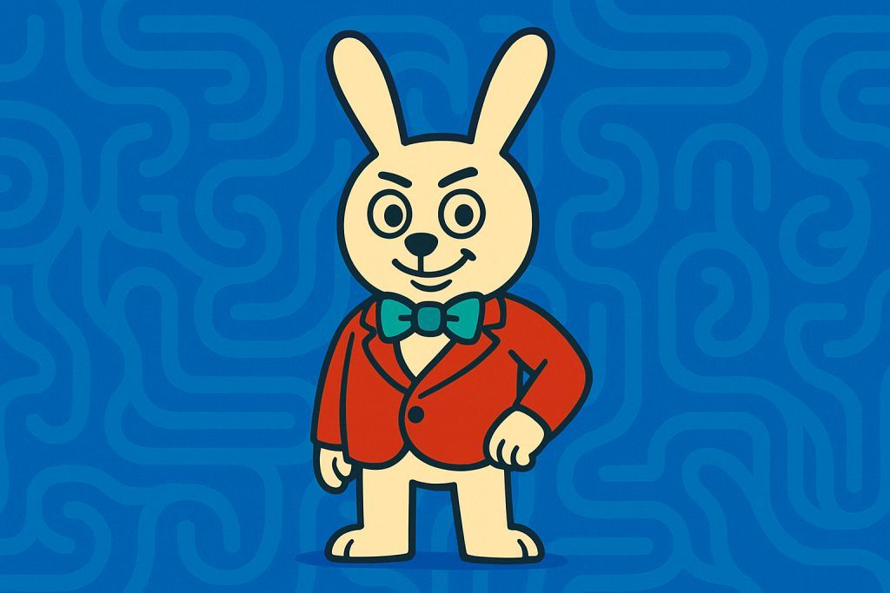

# 🐇 Encounter: Alice Whitehare

> “Oh? You’re not supposed to see me yet.”  
> “I’m Alice Whitehare — from the **Dreamspeak Maze**.  
> That chapter hasn’t been unlocked... *not yet.*”  

She smiles, almost mischievously.

> “Why am I here?  
> Well, dream pathways sometimes leak through the caves.  
> Especially when someone like you gets too curious.”  

She leans closer.

> “Don’t worry. I’m not here to fight.  
> Not today.”  

Then — with a swirl of golden particles — she vanishes.

---

## 🚪 You chose the Right Door...

As you push the door open, the air grows colder.  
A strange silence greets you — no enemies, no treasure...  
Just a long corridor, lined with mirrors.

---

## 🪞 Echoes of Yourself

Each mirror shows a slightly different version of *you*.  
Some look stronger. Some... more broken.

One whispers:  
> “You chose the right path — or did the path choose you?”

Another laughs:  
> “In this world, not all right doors lead to right choices.”

---

## ❓What is this place?

This side of the cave is different.  
It’s not here to fight you.  
It’s here to **reflect** you.

Somewhere in this maze, one of these mirrors hides a truth.  
Others? Just noise, deception, illusion.

---

🧭 You can keep exploring…  
But don’t forget: **you’re being watched.**

And remember:  
> ⭐️ Only those who light up the stars can see through the fog.
